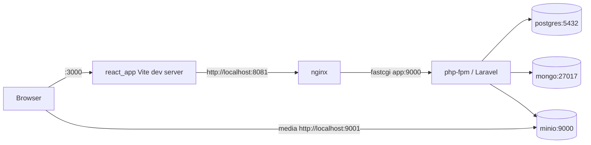

# Save Furry Friend

A small social-posting app: users log in, follow each other, and publish posts with image
attachments. Split into a Laravel API and a React SPA, with a polyglot data layer.

| Concern | Store |
| --- | --- |
| Users, sessions, Sanctum tokens, follows | PostgreSQL |
| Posts (content, tags, media URLs) | MongoDB |
| Uploaded media | MinIO (S3-compatible), bucket `uploads` |



## Layout

```
backend_full_laravel/   Laravel 12 API (PHP 8.2, Sanctum, mongodb/laravel-mongodb, Pest)
frontend_react/         React 19 SPA (Vite 7 + TypeScript 5.8, MUI 7, react-router 7, Vitest)
php/Dockerfile          php-fpm 8.2 image used by the `app` service
nginx/conf.d/           vhost that fronts php-fpm on :8081
docker-compose.yml      app, db, mongo, nginx, react, minio
```

## Ports

| URL | What |
| --- | --- |
| http://localhost:3000 | React app |
| http://localhost:8081 | Laravel API (through nginx) |
| http://localhost:9001 | MinIO S3 API (media URLs point here) |
| http://localhost:9002 | MinIO console — `admin` / `password123` |
| localhost:5432 | PostgreSQL — `root` / `password`, db `blog` |
| localhost:27017 | MongoDB — `admin` / `password`, db `sff` |

## Running locally

Prerequisite: Docker Desktop. Nothing else is needed on the host — PHP, Composer and Node all
live in containers.

`docker compose up` alone is **not** enough: the backend source is bind-mounted over the image,
so `vendor/`, `.env` and the database schema have to be created once, by hand.

### 1. Start the containers

```bash
docker compose up -d --build
```

### 2. Create the backend `.env`

`.env.example` still carries pre-Docker defaults (`DB_HOST=127.0.0.1`, no Mongo/MinIO keys).
Inside the `app` container the services resolve by Compose service name:

```bash
cd backend_full_laravel
cp .env.example .env
```

Then set these values in `backend_full_laravel/.env`:

```dotenv
APP_URL=http://localhost:8081

DB_CONNECTION=pgsql
DB_HOST=db
DB_PORT=5432
DB_DATABASE=blog
DB_USERNAME=root
DB_PASSWORD=password

MONGODB_URI=mongodb://mongo:27017
MONGODB_DATABASE=sff
MONGODB_USERNAME=admin
MONGODB_PASSWORD=password

# MinIO. AWS_ENDPOINT is the in-container address Laravel writes through;
# AWS_URL is the browser-reachable base that Storage::url() builds media URLs
# from. Mongo stores bare object keys, so changing the public host is an .env
# edit rather than a data migration.
AWS_ACCESS_KEY_ID=admin
AWS_SECRET_ACCESS_KEY=password123
AWS_DEFAULT_REGION=us-east-1
AWS_BUCKET=uploads
AWS_ENDPOINT=http://minio:9000
AWS_URL=http://localhost:9001/uploads
AWS_USE_PATH_STYLE_ENDPOINT=true

# Tokens now expire. Minutes; default is 14 days.
SANCTUM_TOKEN_EXPIRATION=20160
```

### 3. Install dependencies, key, schema, seed data

```bash
cd ..
docker compose exec app composer install
docker compose exec app php artisan key:generate
docker compose exec app php artisan migrate
docker compose exec app php artisan db:seed --class=TestUserSeeder
```

There is no `DatabaseSeeder`, so the seeder class must be named explicitly.

### 4. Create the MinIO bucket (fresh volume only)

Media uploads write to a bucket named `uploads`. If the `minio-data` volume is new, create it:
open http://localhost:9002 (`admin` / `password123`) → **Buckets** → **Create Bucket** → `uploads`.

### 5. Check it

```bash
curl -i http://localhost:8081/up          # Laravel health check
open http://localhost:3000                # React app
```

Log in with a seeded account:

| Email | Password |
| --- | --- |
| test@user.com | password112233 |
| test2@user.com | password112233 |

## Day-to-day commands

Backend (all inside the `app` container):

```bash
docker compose exec app php artisan migrate:fresh --seed --seeder=TestUserSeeder
docker compose exec app php artisan tinker
docker compose exec app composer test        # Pest, against real Postgres + Mongo
docker compose exec app composer phpstan
docker compose exec app composer ecs-check   # ecs-fix to apply
docker compose exec app composer rector      # rector-fix to apply
docker compose logs -f app
```

`composer test` needs two dedicated databases, not sqlite: a Postgres database named `testing` and
a Mongo database named `sff_testing` (see `phpunit.xml`). `RefreshDatabase` only migrates and
transacts the default connection, so `tests/Pest.php` truncates the Mongo `posts` collection per
test — and refuses to run at all unless the Mongo database name ends in `_testing`, because pointed
at `sff` that would delete real data. Create the Postgres one once:

```bash
docker compose exec db createdb -U root testing
```

Frontend:

```bash
docker compose logs -f react                 # Vite dev server output
docker compose exec react yarn add <pkg>
docker compose exec react yarn typecheck     # tsc --noEmit
docker compose exec react yarn lint          # eslint, --max-warnings 0
docker compose exec react yarn format:check  # prettier
docker compose exec react yarn test          # vitest
docker compose exec react yarn build         # production bundle into frontend_react/build
```

The build tool is **Vite 7** with **Vitest**; `react-scripts` is gone. `src/config/api.ts` reads
`VITE_API_BASE_URL` and *throws* when it is unset, so every build needs it — the `react` service
supplies it in `docker-compose.yml`, and `frontend_react/.env.example` documents it for host-side
builds (`cp .env.example .env`).

The frontend is **yarn only** — `yarn.lock` is the single lockfile and the image installs with
`yarn install --frozen-lockfile`. After changing `package.json`/`yarn.lock`, rebuild *and* discard
the stale dependency volume, or the container keeps serving the old tree:

```bash
docker compose up -d --build --force-recreate --renew-anon-volumes react
```

The React container mounts the source and keeps its own `node_modules` (anonymous volume), so
host-side `yarn install` is optional. Host edits hot-reload: `vite.config.ts` sets
`server.watch.usePolling` because inotify events are not delivered reliably over a Docker bind
mount. Polling costs some CPU; drop it if native file watching works on your machine.

`yarn lint` runs at `--max-warnings 0` and `yarn build` runs `tsc --noEmit` first, so both fail on
anything CI would fail on. The lint warnings this project used to carry (`eqeqeq`, unused
`setEditId`, `react-hooks/exhaustive-deps`) are fixed, and those three rules are now errors.

## API surface

Every endpoint is declared in `backend_full_laravel/routes/api.php` and served under the `/api`
prefix from `withRouting(apiPrefix: 'api')`. Auth is **stateless bearer token only** — no session,
no CSRF, no cookies. Errors are always JSON.

| Method | Path | Auth |
| --- | --- | --- |
| POST | `/api/login` | public, `throttle:login` (5/min per email+IP, 20/min per IP) |
| POST | `/api/users` | public registration, `throttle:5,1` |
| POST | `/api/logout` | bearer — revokes the presented token |
| GET | `/api/users` | bearer |
| GET/PUT/DELETE | `/api/users/{user}` | bearer, own account only (`UserPolicy`) |
| GET | `/api/users/search/{keyword}` | bearer |
| POST | `/api/users/{user}/follow`, `/api/users/{user}/unfollow` | bearer |
| GET/POST | `/api/posts` | bearer |
| GET/PUT/DELETE | `/api/posts/{post}` | bearer, own posts only for writes (`PostPolicy`) |

Everything in the authenticated group also carries `throttle:api` (60/min per user, falling back to
IP). Sanctum tokens expire — `SANCTUM_TOKEN_EXPIRATION`, with `sanctum:prune-expired` scheduled
daily in `routes/console.php`.

Shapes worth knowing:

- `POST /api/login` returns `{ message, token, user }`. Send the token as `Authorization: Bearer <token>`.
- Single resources are wrapped: `{ "data": { … } }`. `GET /api/posts` is **paginated** —
  `{ data: [...], links, meta }` — and takes `tags[]`, `authorId` and `per_page` (max 50), all validated.
- The feed is always scoped to the follow graph plus your own posts. There is no "everything" mode.
- `medias` is stored in Mongo as bare object keys and rendered to absolute URLs by `PostResource`.
- Validation failures are `422` with `{ message, errors: { field: [...] } }`; missing records are `404` JSON.

No CSRF dance is needed any more:

```bash
TOKEN=$(curl -s -X POST http://localhost:8081/api/login \
  -H 'Content-Type: application/json' \
  -d '{"email":"test@user.com","password":"password112233"}' | jq -r .token)

curl -s -H "Authorization: Bearer $TOKEN" \
  -F 'content=hello' -F 'tags[]=happy_post' -F 'medias[]=@./cat.png' \
  http://localhost:8081/api/posts
```

CORS (`config/cors.php`) only allows `http://localhost:3000`, so the SPA must be served from that
origin.

## Troubleshooting

**`bind: address already in use` / `port is already allocated`** — this project publishes 3000,
5432, 8081, 9000, 9001, 9002 and 27017. One clash aborts the whole `docker compose up` and leaves
the other services stopped. Which fix applies depends on *what* clashes:

- **Only :3000 (the SPA)** — start everything else and deal with the SPA separately:
  `docker compose up -d app db mongo nginx minio`.
- **A datastore port** (another Compose project's MinIO on 9001 or Mongo on 27017 is the usual
  culprit) — selective start does *not* help, since those services publish the clashing port
  themselves. Stop the other stack, or remap the port in `docker-compose.yml` / a local
  `docker-compose.override.yml`. Nothing in this app needs host access to Mongo, so dropping its
  `ports:` entry is the cheapest fix.

Two caveats when remapping: moving the SPA off 3000 means adding the new origin to
`config/cors.php`, and moving MinIO off host 9001 means updating `AWS_URL`. Media URLs are no longer
baked into the database — Mongo stores bare object keys and `PostResource` builds the URL from
`AWS_URL` at render time — so that is a one-line `.env` change rather than a data migration.

**A container is `Up` but unreachable by service name** — long-lived containers can be left attached
to a deleted network (`docker inspect -f '{{.NetworkSettings.Networks}}' <name>` prints empty), which
shows up as `Could not resolve host: minio` or `could not translate host name "db"`. Recreate them:
`docker compose rm -sf <service> && docker compose up -d <service>`.

**`could not translate host name "db"`** — the `db` container is not running. `docker compose ps -a`;
if Postgres exited, check `docker logs postgres`.

**Postgres refuses to start after an image bump** — the `db` service is pinned to `postgres:16` on
purpose. Postgres 18 changed its data directory layout and will not start against the existing
`pgdata` volume. Wiping local DB data is `docker compose down -v` followed by migrate + seed again.

**`vite: not found` in the react container** — the `/app/node_modules` anonymous volume is
missing or was removed. Rebuild: `docker compose up -d --build --force-recreate react`.

**Uploads fail with a bucket error** — the `uploads` bucket does not exist yet; see step 4.

**Upload returns 413 Request Entity Too Large** — `nginx/conf.d/default.conf` sets no
`client_max_body_size`, so nginx caps request bodies at its 1 MB default. Add
`client_max_body_size 20m;` to the `server` block (and restart nginx) before uploading real photos.

**Frontend serves but shows a compile error overlay** — read `docker compose logs react`. The
container's filesystem is case-sensitive, so import paths whose casing differs from the file on
disk fail there while working fine on macOS.

## CI

`.github/workflows/main.yml` runs PHPStan, ECS, Rector (dry-run) and Pest against
`backend_full_laravel` on every push and pull request. There is no frontend job.

Pest needs real databases, so the job runs `postgres:16` and `mongo:8.0` service containers and
installs the `mongodb` PHP extension. `phpunit.xml` carries the Compose hostnames (`db`, `mongo`)
and the job exports `DB_HOST` / `MONGODB_URI` to point at `127.0.0.1` instead — PHPUnit does not
overwrite variables that already exist in the environment, so the exports win.

