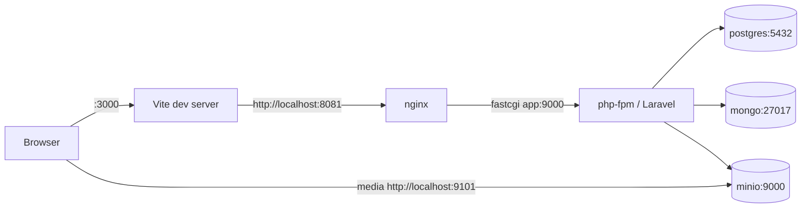

# Save Furry Friend

A small social-posting app: users log in, follow each other, and publish posts with image
attachments. Split into a Laravel API and a React SPA, with a polyglot data layer.

| Concern | Store |
| --- | --- |
| Users, sessions, Sanctum tokens, follows | PostgreSQL |
| Posts (content, tags, media URLs) | MongoDB |
| Uploaded media | MinIO (S3-compatible), bucket `uploads` |



## Layout

```
backend_full_laravel/   Laravel 12 API (PHP 8.2, Sanctum, mongodb/laravel-mongodb, Pest)
frontend_react/         React 19 SPA (Vite 7 + TypeScript 5.8, MUI 7, react-router 7, Vitest)
php/Dockerfile          php-fpm 8.2 image used by the `app` service
nginx/conf.d/           vhost that fronts php-fpm on :8081
docker-compose.yml      app, db, mongo, nginx, react, minio
```

## Ports

Every host port is a variable in the root `./.env`, so a clash with another
stack is a one-line edit rather than a compose-file diff.

| URL | What | `./.env` |
| --- | --- | --- |
| http://localhost:3000 | React app | `REACT_PORT` |
| http://localhost:8081 | Laravel API (through nginx) | `NGINX_PORT` |
| http://localhost:9101 | MinIO S3 API (media URLs point here) | `MINIO_API_PORT` |
| http://localhost:9102 | MinIO console | `MINIO_CONSOLE_PORT` |
| 127.0.0.1:5432 | PostgreSQL, loopback only — db `blog` | `POSTGRES_PORT` |
| *(not published)* | MongoDB — `docker compose exec mongo mongosh` | — |

Credentials live in `./.env` (copied from `.env.docker.example`), not in the compose file.
php-fpm is deliberately not published: fastcgi has no authentication and only nginx needs it.
MinIO sits on 9101/9102 rather than the conventional 9000/9001 because those are commonly taken by
other local stacks; `MINIO_API_PORT` and `AWS_URL` in `backend_full_laravel/.env` must move together.

## Running locally

Prerequisite: Docker Desktop and `make`. Nothing else is needed on the host — PHP, Composer and
Node all live in containers.

```bash
cp .env.docker.example .env          # compose credentials and published ports
make bootstrap                       # ~2 min on a cold cache
```

`docker compose up` on its own is still not enough — the backend source is bind-mounted over the
image, so `vendor/`, `.env` and the schema have to be created once. `make bootstrap` is that once:

1. creates `backend_full_laravel/.env` from `.env.example`, and `./.env` from
   `.env.docker.example` if you skipped the `cp` above — neither is overwritten if it exists;
2. `docker compose up -d --build --wait`. `--wait` blocks until every healthcheck reports healthy,
   so the next step cannot race Postgres creating its cluster on a fresh `pgdata` volume;
3. `composer install`, plus `php artisan key:generate` when `APP_KEY` is still empty;
4. `php artisan migrate --seed` — `DatabaseSeeder` calls `TestUserSeeder`, which matches on email,
   so re-running `make bootstrap` against a live stack is safe;
5. prints the URLs and the seeded login.

Creating the `uploads` bucket is no longer a manual click: the `minio-init` service creates it and
applies the anonymous-download policy as soon as MinIO reports healthy.

Check it:

```bash
curl -i http://localhost:8081/up          # Laravel health check
open http://localhost:3000                # React app
```

Log in with a seeded account:

| Email | Password |
| --- | --- |
| test@user.com | password112233 |
| test2@user.com | password112233 |

`make help` lists the rest: `up`, `down`, `env`, `deps`, `fresh`, `logs`, `shell`, `test`, `lint`.
Datastore credentials and the published ports live in `./.env` (gitignored, template in
`.env.docker.example`); everything Laravel reads lives in `backend_full_laravel/.env`.

## Day-to-day commands

Backend (all inside the `app` container):

```bash
docker compose exec app php artisan migrate:fresh --seed
docker compose exec app php artisan tinker
docker compose exec app composer test        # Pest, against real Postgres + Mongo
docker compose exec app composer phpstan
docker compose exec app composer ecs-check   # ecs-fix to apply
docker compose exec app composer rector      # rector-fix to apply
docker compose logs -f app
```

`make fresh` is the first line; `make test` and `make lint` run the backend checks above *and* the
frontend ones below in one go.

`composer test` needs two dedicated databases, not sqlite: a Postgres database named `testing` and
a Mongo database named `sff_testing` (see `phpunit.xml`). `RefreshDatabase` only migrates and
transacts the default connection, so `tests/Pest.php` truncates the Mongo `posts` collection per
test — and refuses to run at all unless the Mongo database name ends in `_testing`, because pointed
at `sff` that would delete real data. Create the Postgres one once:

```bash
docker compose exec db createdb -U root testing
```

Frontend:

```bash
docker compose logs -f react                 # Vite dev server output
docker compose exec react yarn add <pkg>
docker compose exec react yarn typecheck     # tsc --noEmit
docker compose exec react yarn lint          # eslint, --max-warnings 0
docker compose exec react yarn format:check  # prettier
docker compose exec react yarn test          # vitest
docker compose exec react yarn build         # production bundle into frontend_react/build
```

The build tool is **Vite 7** with **Vitest**; `react-scripts` is gone. `src/config/api.ts` reads
`VITE_API_BASE_URL` and *throws* when it is unset, so every build needs it — the `react` service
supplies it in `docker-compose.yml`, and `frontend_react/.env.example` documents it for host-side
builds (`cp .env.example .env`).

The frontend is **yarn only** — `yarn.lock` is the single lockfile and the image installs with
`yarn install --frozen-lockfile`. After changing `package.json`/`yarn.lock`, rebuild *and* discard
the stale dependency volume, or the container keeps serving the old tree:

```bash
docker compose up -d --build --force-recreate --renew-anon-volumes react
```

The React container mounts the source and keeps its own `node_modules` (anonymous volume), so
host-side `yarn install` is optional. Host edits hot-reload: `vite.config.ts` sets
`server.watch.usePolling` because inotify events are not delivered reliably over a Docker bind
mount. Polling costs some CPU; drop it if native file watching works on your machine.

`yarn lint` runs at `--max-warnings 0` and `yarn build` runs `tsc --noEmit` first, so both fail on
anything CI would fail on. The lint warnings this project used to carry (`eqeqeq`, unused
`setEditId`, `react-hooks/exhaustive-deps`) are fixed, and those three rules are now errors.

## API surface

Every endpoint is declared in `backend_full_laravel/routes/api.php` and served under the `/api`
prefix from `withRouting(apiPrefix: 'api')`. Auth is **stateless bearer token only** — no session,
no CSRF, no cookies. Errors are always JSON.

| Method | Path | Auth |
| --- | --- | --- |
| POST | `/api/login` | public, `throttle:login` (5/min per email+IP, 20/min per IP) |
| POST | `/api/users` | public registration, `throttle:5,1` |
| POST | `/api/logout` | bearer — revokes the presented token |
| GET | `/api/users` | bearer |
| GET/PUT/DELETE | `/api/users/{user}` | bearer, own account only (`UserPolicy`) |
| GET | `/api/users/search/{keyword}` | bearer |
| POST | `/api/users/{user}/follow`, `/api/users/{user}/unfollow` | bearer |
| GET/POST | `/api/posts` | bearer |
| GET/PUT/DELETE | `/api/posts/{post}` | bearer, own posts only for writes (`PostPolicy`) |

Everything in the authenticated group also carries `throttle:api` (60/min per user, falling back to
IP). Sanctum tokens expire — `SANCTUM_TOKEN_EXPIRATION`, with `sanctum:prune-expired` scheduled
daily in `routes/console.php`.

Shapes worth knowing:

- `POST /api/login` returns `{ message, token, user }`. Send the token as `Authorization: Bearer <token>`.
- Single resources are wrapped: `{ "data": { … } }`. `GET /api/posts` is **paginated** —
  `{ data: [...], links, meta }` — and takes `tags[]`, `authorId` and `per_page` (max 50), all validated.
- The feed is always scoped to the follow graph plus your own posts. There is no "everything" mode.
- `medias` is stored in Mongo as bare object keys and rendered to absolute URLs by `PostResource`.
- Validation failures are `422` with `{ message, errors: { field: [...] } }`; missing records are `404` JSON.

No CSRF dance is needed any more:

```bash
TOKEN=$(curl -s -X POST http://localhost:8081/api/login \
  -H 'Content-Type: application/json' \
  -d '{"email":"test@user.com","password":"password112233"}' | jq -r .token)

curl -s -H "Authorization: Bearer $TOKEN" \
  -F 'content=hello' -F 'tags[]=happy_post' -F 'medias[]=@./cat.png' \
  http://localhost:8081/api/posts
```

CORS (`config/cors.php`) allows exactly one origin, `env('FRONTEND_URL', 'http://localhost:3000')`,
so the SPA must be served from wherever `FRONTEND_URL` in `backend_full_laravel/.env` points.

## Troubleshooting

**`bind: address already in use` / `port is already allocated`** — the stack publishes only what a
browser or a local client needs: `REACT_PORT` (3000), `NGINX_PORT` (8081), `MINIO_API_PORT` (9101),
`MINIO_CONSOLE_PORT` (9102) and Postgres on `127.0.0.1:5432`. php-fpm and MongoDB are not published
at all. One clash still aborts the whole `up`, but the fix is now a variable, not a file edit:

```bash
# ./.env
REACT_PORT=3100
```

then `make up`. For anything more involved than a port number, copy
`docker-compose.override.yml.example` to `docker-compose.override.yml` (gitignored, merged
automatically) rather than editing the tracked compose file.

Two couplings to respect when remapping. Moving the SPA means moving `FRONTEND_URL` in
`backend_full_laravel/.env` too, or login fails the CORS preflight with nothing in the Laravel log.
Moving MinIO's API port means moving `AWS_URL` — media URLs are not baked into the database (Mongo
stores bare object keys and `PostResource` builds the URL at render time), so that is a one-line
`.env` change rather than a data migration.

**A container is `Up` but unreachable by service name** — long-lived containers can be left attached
to a deleted network (`docker inspect -f '{{.NetworkSettings.Networks}}' <name>` prints empty), which
shows up as `Could not resolve host: minio` or `could not translate host name "db"`. Recreate them:
`docker compose rm -sf <service> && docker compose up -d <service>`.

**`could not translate host name "db"`** — the `db` container is not running. `docker compose ps -a`;
if Postgres exited, check `docker compose logs db`.

**Postgres refuses to start after an image bump** — the `db` service is pinned to `postgres:16` on
purpose. Postgres 18 changed its data directory layout and will not start against the existing
`pgdata` volume. Wiping local DB data is `docker compose down -v` followed by migrate + seed again.

**`vite: not found` in the react container** — the `/app/node_modules` anonymous volume is stale and
shadows the image's own `node_modules`, so a rebuild alone does not help. Discard the volume too:
`docker compose up -d --build --force-recreate --renew-anon-volumes react`.

**Uploads fail with a bucket error** — the `minio-init` service creates the `uploads` bucket and sets
its anonymous download policy on every `up`; if uploads still fail, it exited non-zero:
`docker compose logs minio-init`.

**Upload returns 413 Request Entity Too Large** — the ceiling is 32 MB, set in two places that must
agree: `client_max_body_size 32m` in `nginx/conf.d/default.conf` and `upload_max_filesize=32M` /
`post_max_size=40M` in `php/uploads.ini`. The smaller of the two wins, so raise both. Changing
`php/uploads.ini` needs an image rebuild (`docker compose up -d --build app`).

**Frontend serves but shows a compile error overlay** — read `docker compose logs react`. The
container's filesystem is case-sensitive, so import paths whose casing differs from the file on
disk fail there while working fine on macOS.

## CI

`.github/workflows/main.yml` runs three jobs on every push and pull request:

| Job | What it proves |
| --- | --- |
| `code-quality` | PHPStan, ECS, Rector (dry-run) and Pest against `backend_full_laravel`, with Composer downloads cached on `composer.lock` |
| `frontend` | `yarn typecheck`, `yarn lint`, `yarn format:check`, `yarn test` and `yarn build` against `frontend_react` |
| `compose` | `docker compose config -q` and `docker compose build` — a broken bind mount, a floating image tag or a key missing from `.env.docker.example` fails here instead of on someone's first clone |

Pest needs real databases, so `code-quality` runs `postgres:16` and `mongo:8.0` service containers
and installs the `mongodb` PHP extension. `phpunit.xml` carries the Compose hostnames (`db`,
`mongo`) and the job exports `DB_HOST` / `MONGODB_URI` to point at `127.0.0.1` instead — PHPUnit
does not overwrite variables that already exist in the environment, so the exports win.

`compose` copies `.env.docker.example` to `.env` first, because compose interpolation aborts on the
`${VAR:?}` form when a credential is missing.

